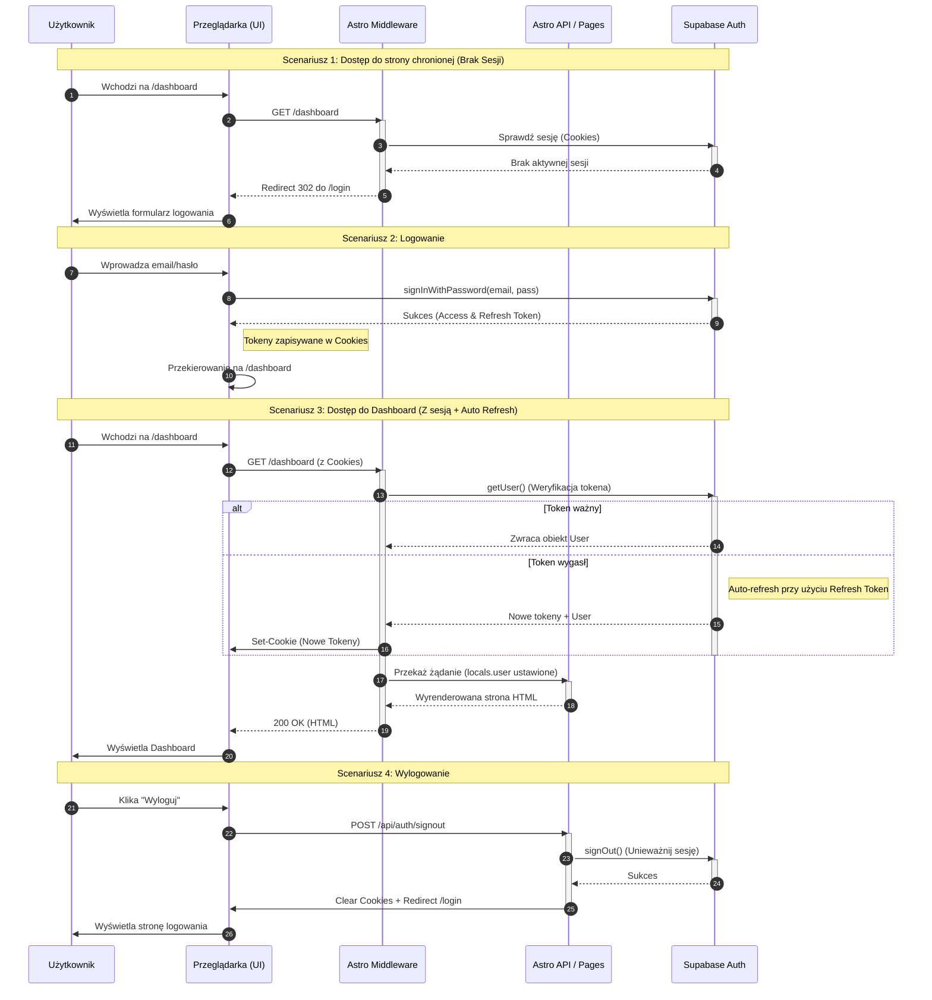

# Diagram Auth - Sekwencja Autentykacji

<authentication_analysis>

1. **Przepływy autentykacji**:
   - **Logowanie (Sign In)**: Użytkownik podaje email/hasło -> Supabase weryfikuje -> Zwraca tokeny -> Zapis w cookies -> Przekierowanie.
   - **Rejestracja (Sign Up)**: Użytkownik podaje dane -> Utworzenie konta w Supabase -> Automatyczne logowanie (jeśli email conf wyłączone) lub oczekiwanie.
   - **Weryfikacja Sesji (Middleware)**: Każde żądanie do serwera przechodzi przez Middleware -> Pobranie tokena z cookies -> Weryfikacja w Supabase -> Ustawienie kontekstu lub przekierowanie.
   - **Odświeżanie Tokena (Token Refresh)**: Middleware wykrywa wygasający Access Token -> Używa Refresh Token do pobrania nowego -> Aktualizacja cookies.
   - **Wylogowanie (Sign Out)**: Żądanie klienta -> Wyczyszczenie sesji w Supabase -> Usunięcie cookies -> Przekierowanie na login.

2. **Główni Aktorzy**:
   - **User (Użytkownik)**: Inicjuje akcje.
   - **Browser (Przeglądarka)**: Renderuje UI, przechowuje cookies, wysyła żądania.
   - **Middleware (Astro Server)**: Pośrednik weryfikujący każde żądanie serwerowe, zarządza sesją SSR.
   - **Astro API / Pages**: Endpointy i strony renderowane po stronie serwera.
   - **Supabase Auth**: Zewnętrzny dostawca tożsamości (Identity Provider).

3. **Procesy weryfikacji i odświeżania**:
   - Tokeny są przechowywane w ciasteczkach `HttpOnly` (bezpieczne).
   - `@supabase/ssr` automatycznie zarządza cyklem życia tokenów w middleware.
   - Jeśli Access Token wygasł, ale Refresh Token jest ważny, Supabase SDK automatycznie wymienia go na nową parę.

4. **Kroki autentykacji**:
   - Użytkownik wchodzi na stronę chronioną -> Middleware sprawdza cookies -> Brak? Redirect Login.
   - Użytkownik loguje się -> Client SDK wywołuje Supabase -> Supabase zwraca sesję -> Client ustawia cookies (lub wywołuje API callback) -> Przeładowanie/Przekierowanie.
     </authentication_analysis>

