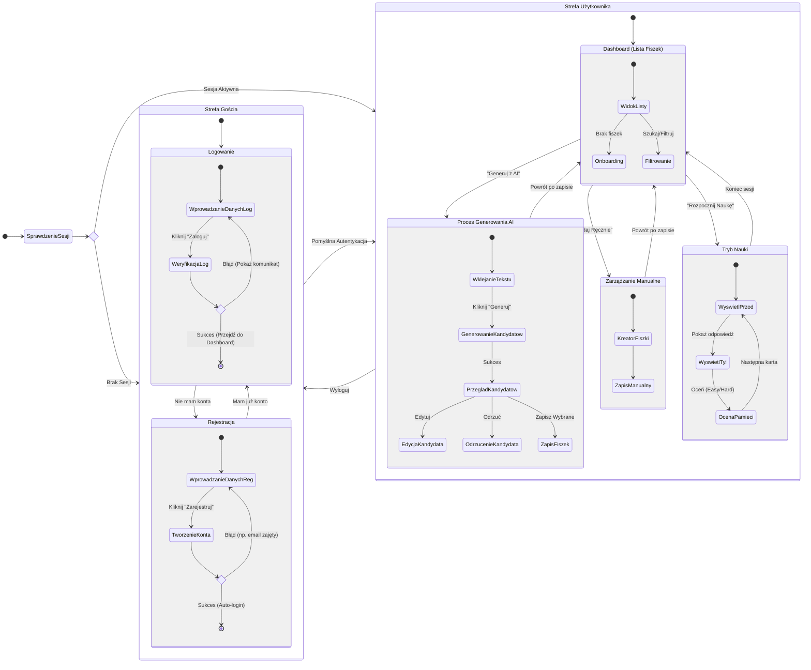

# Diagram Journey - Podróż Użytkownika

<user_journey_analysis>

1. **Ścieżki użytkownika (z PRD i Auth Spec)**:
   - **Nowy Użytkownik**: Wejście na stronę -> Rejestracja -> Auto-login -> Dashboard (Onboarding).
   - **Powracający Użytkownik (Niezalogowany)**: Wejście na stronę -> Przekierowanie na Login -> Logowanie -> Dashboard.
   - **Zalogowany Użytkownik**: Wejście na stronę -> Dashboard -> Generowanie/Przeglądanie/Nauka -> Wylogowanie.
   - **Błędy Autentykacji**: Błędne hasło, istniejący email przy rejestracji.

2. **Główne Stany**:
   - **Niezalogowany (Guest)**: Dostęp tylko do Login/Register. Próba wejścia na Dashboard przekierowuje.
   - **Proces Logowania**: Wprowadzanie danych, walidacja.
   - **Proces Rejestracji**: Wprowadzanie danych, tworzenie konta.
   - **Zalogowany (Authenticated)**: Dostęp do Dashboard, Generowania, Listy Fiszek, Trybu Nauki.

3. **Punkty Decyzyjne**:
   - Czy użytkownik ma konto? (Tak -> Login, Nie -> Register).
   - Czy dane logowania poprawne? (Tak -> Dashboard, Nie -> Błąd).
   - Czy użytkownik jest już zalogowany przy wejściu? (Tak -> Dashboard, Nie -> Login).

4. **Opis Stanów**:
   - **Landing/Login**: Punkt startowy dla niezalogowanych.
   - **Dashboard**: Główne centrum dowodzenia (Lista fiszek, przycisk generuj).
   - **Generowanie**: Proces tworzenia fiszek z tekstu.
   - **Review**: Przegląd i edycja wygenerowanych kandydatów.
   - **Nauka**: Tryb Spaced Repetition.
</user_journey_analysis>

