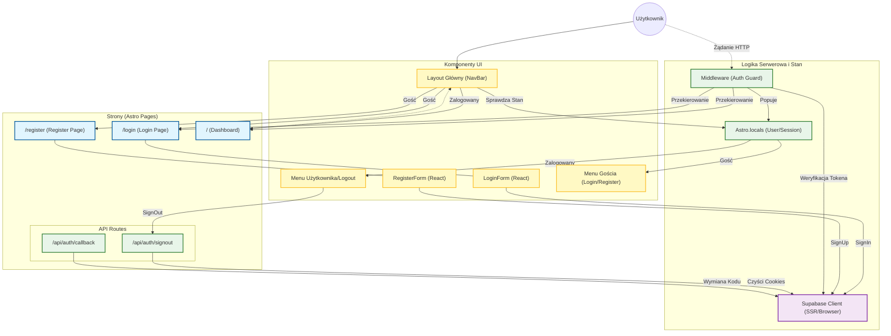

# Diagram UI - Architektura Autentykacji

## Analiza Architektury

1. **Komponenty z plików referencyjnych**:
   - Strony: `src/pages/login.astro`, `src/pages/register.astro`, `src/pages/index.astro`, `src/pages/api/auth/signout.ts`, `src/pages/api/auth/callback.ts`
   - Komponenty React: `LoginForm.tsx`, `RegisterForm.tsx`
   - Layout: `src/layouts/Layout.astro` (z dynamicznym paskiem nawigacji)
   - Middleware: `src/middleware/index.ts`
   - Serwisy: `supabase.client.ts`, `supabase.server.ts`

2. **Główne strony i komponenty**:
   - **Strona Logowania**: Zawiera `LoginForm`. Dostępna tylko dla gości.
   - **Strona Rejestracji**: Zawiera `RegisterForm`. Dostępna tylko dla gości.
   - **Strona Główna (Dashboard)**: Chroniona, dostępna dla zalogowanych.
   - **Layout**: Zarządza nawigacją (stan zalogowany/wylogowany).

3. **Przepływ danych**:
   - Użytkownik wprowadza dane w formularzach (Client-side).
   - Formularze komunikują się z Supabase Auth (Client).
   - Sesja jest przechowywana w ciasteczkach.
   - Middleware (Server-side) weryfikuje sesję przy każdym żądaniu.
   - Middleware udostępnia obiekt użytkownika w `Astro.locals`.
   - Layout odczytuje `Astro.locals.user` by dostosować UI.

4. **Opis funkcjonalności**:
   - **LoginForm/RegisterForm**: Walidacja Zod, obsługa błędów, wywołania Supabase SDK.
   - **Middleware**: Strażnik tras (Route Guard), odświeżanie sesji.
   - **API Routes**: Obsługa wylogowania i callbacków OAuth/MagicLink (wymiana kodu na sesję).

## Diagram Mermaid

